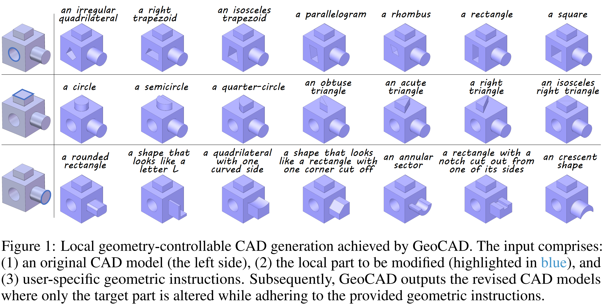
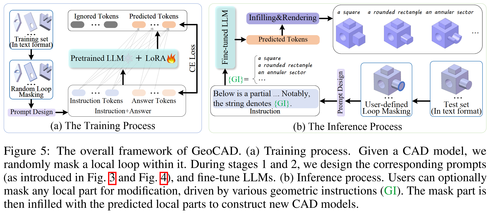

# GeoCAD
[NeurIPS 2025] [**GeoCAD: Local Geometry-Controllable CAD Generation**](https://arxiv.org/abs/2506.10337)  
Zhanwei Zhang , Kaiyuan Liu, Junjie Liu, Wenxiao Wang, Binbin Lin,
Liang Xie, Chen Shen, Deng Cai.  


  
  
Local geometry-controllable computer-aided design (CAD) generation aims to modify local parts of CAD models automatically, enhancing design efficiency. It also ensures that the shapes of newly generated local parts follow user-specific geometric instructions (e.g., an isosceles right triangle or a rectangle with one corner cut off). 


# Installation
- Create a conda environment and install all the dependencies
```
conda env create -f environments.yaml
```
- After installation, activate the environment with
```
conda activate <env>
```

# Data preparation
- Download the processed data by [SkexGen](https://github.com/samxuxiang/SkexGen): [Google Drive link](https://drive.google.com/file/d/1so_CCGLIhqGEDQxMoiR--A4CQk4MjuOp/view).
```
gdown --id 1so_CCGLIhqGEDQxMoiR--A4CQk4MjuOp
```
- Convert the dicts to the sequences. Note ```train.pkl```, ```val.pkl``` and ```test.pkl``` should be converted separately.
- circle_type: [ udlr, ldru, diam, or ]. 

```
python3 utils/convert.py --in_path <in_path_name> --out_path <out_path_name> --circle_type <circle_type_name>
```
For example:
```
python3 utils/convert.py --in_path ./cad_data/train_deduplicate_s.pkl --out_path ./cad_data/processed_data/train_ds.pkl --circle_type ldru
```

Please see the loop captions in the ```./cad_data/processed_data``` directory.

# Training
Since the pre-training phase is optional and straightforward to implement, we only release the training code in this work.  
- Run training with multiple GPUs. Change ```num_processes``` in ```ds_config.yaml``` to specify how many GPUs will be used.
```
CUDA_VISIBLE_DEVICES=<gpu_ids> accelerate launch --config_file ds_config.yaml finetune.py --run-name <run_name> --data-path <data_path> --eval-freq 200000 --save-freq 50000 --model-name <model_name>
```

- Run training with single GPU.
```
CUDA_VISIBLE_DEVICES=<gpu_id> python3 finetune.py --run-name <run_name> --data-path <data_path> --eval-freq 100000 --save-freq 25000 --model_name <model_name>
```
# Inference
Notably, as the original test set contains substantial noise, it is essential to filter out invalid CAD sequences from the test set before inference.
```
CUDA_VISIBLE_DEVICES=<gpu_id> python3 sample.py --model_path <model_checkpoint_path> --num_samples <num_samples> --model_name <model_name> --mask_type loop
``` 


The output should be a jsonl file, where each line is a string representing a CAD design.
# Visualization
- Step 1: parse the generated string to CAD obj. The in_path should be set the same as the out_path in the inference. 
```
python3 utils/parser.py --in_path <in_path> --out_path <out_path>
```
- Step 2: convert generated CAD obj to stl format. Use timeout command to prevent occ hanging. The data_folder should be set the same as the out_path in step 1.
```
timeout 180 python3 utils/visual_obj.py --data_folder <data_folder>
```
- Step 3: render and visualize to images. The input_dir should be set the same as the data_folder in step 2. Note that this step only succeeds on Windows now.
```
python3 utils/cad_img.py --input_dir <input_dir> --output_dir <output_dir>
```


## Citation
If you find our work useful in your research, please cite our paper:
```
@article{zhang2025geocad,
  title={GeoCAD: Local Geometry-Controllable CAD Generation},
  author={Zhang, Zhanwei and Liu, Kaiyuan and Liu, Junjie and Wang, Wenxiao and Lin, Binbin and Xie, Liang and Shen, Chen and Cai, Deng},
  journal={arXiv preprint arXiv:2506.10337},
  year={2025}
}
```

## Acknowledgement

Our code is partially based on [FlexCAD](https://github.com/microsoft/FlexCAD), [Skexgen](https://github.com/samxuxiang/SkexGen) and [Crystal-text-llm](https://github.com/facebookresearch/crystal-text-llm). 
We appreciate all the contributors for their awesome work.


